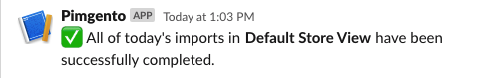
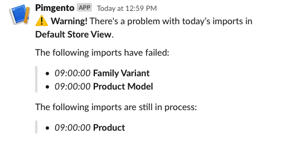

# Slack Notifications

To be keep abreast of the statuses of today's Pimgento imports you could make use of this functionality to get 
notifications of this in a specific Slack channel.

## Configuration
To be able to use the functionality it is important that the configuration is done correctly.

* Go to **Stores** -> **Configuration** -> **Catalog** -> **Pimgento** -> **Slack**
* Set Enable to "Yes"
* Enter the details:
    * Enter your Slack token to authenticate the app. (Read more about tokens: https://api.slack.com/docs/token-types)
    * Enter the bot's user name in Username
    * Enter the channel you want to send the notifications. Channels always start with #. Could be an encoded ID, or a name.
* Save Config

## Usage
### Command
To send the Slack notification you could simply use the command: `bin/magento slack:imports`. If the configuration is done
correctly, this will send a notification to your given Slack channel.

### Cron
You could setup a cronjob for sending the Slack notification messages. 

Go to **Stores** -> **Configuration** -> **Advanced** -> **System** -> **Cron configuration options for group: slack_cron** and configure the cronjob

## Messages
There're different types of messages

### Success

This message will be send when all imports succesfully completed.

### Failed
This message will be send if there's a problem with today's imports. The message can contain a list with
imports that has errors and a list of imports that are still in process.

